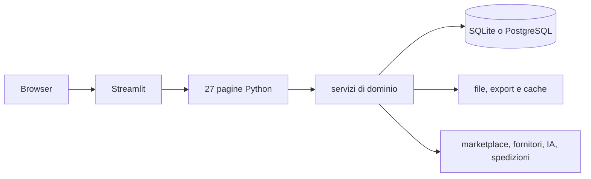
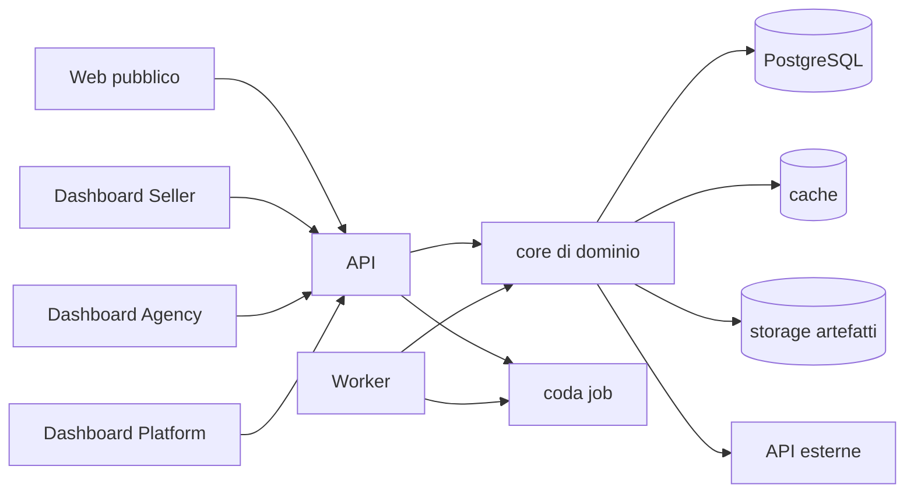

# Architettura

## Stato originale verificato

Streamlit combina rendering, stato di sessione e orchestrazione. I servizi contengono buona parte della logica riutilizzabile, ma alcune regole, trasformazioni e operazioni lunghe sono ancora nelle pagine. Il deployment GitHub originale è un singolo container web.

## Architettura di destinazione

La nuova architettura conserva il comportamento e separa le responsabilità:

Vincoli:

- un unico motore di dominio per Seller, Agency e Platform;
- autorizzazione e tenant scope verificati sul backend;
- formule e regole nel core, non nel frontend;
- chiamate lunghe eseguite dal worker con stato, avanzamento, retry e risultato persistenti;
- dati durevoli in PostgreSQL, cache distinguibile e rigenerabile, file in storage;
- adapter per marketplace e fornitori senza appiattire le differenze operative;
- API e job idempotenti quando una ripetizione può creare duplicati;
- osservabilità con correlation ID, audit trail ed errori utilizzabili dall'operatore.

## Sequenza di migrazione

Il ramo parte vuoto. Ogni modulo viene portato soltanto dopo aver scritto la matrice input → trasformazione → persistenza → output e i casi di confronto con la versione 271. Il SaaS precedente resta congelato e online finché il sostituto non supera lo staging.
